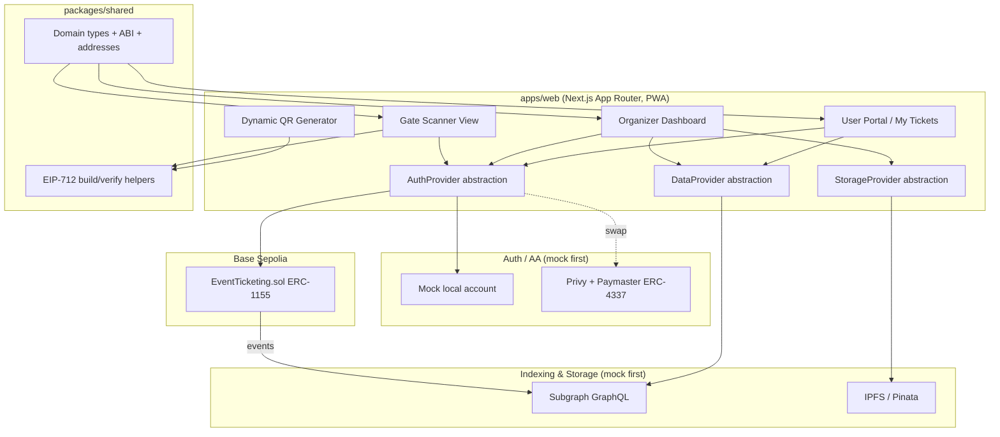

# Design Document

## Overview

This design describes a decentralized event ticketing platform built as a pnpm + turborepo monorepo. Tickets are ERC-1155 tokens with per-`(eventId, tier)` serial tracking, enabling individual ticket state (ownership and used-status) on top of an otherwise fungible standard. Anti-scalping is enforced by blocking direct transfers and routing all P2P sales through an on-chain `resellTicket` function that caps price. A Web2-like experience is delivered through an `AuthProvider` abstraction (mock first, Privy + ERC-4337 paymaster later) and dynamic, time-sensitive EIP-712 QR codes. Contract events are indexed by a subgraph exposed over GraphQL and consumed through a `DataProvider` abstraction. Event metadata is stored via a `StorageProvider` abstraction (mock first, Pinata/IPFS later).

The design goal for external services is substitutability: every third-party dependency sits behind an interface with a mock implementation and an environment flag, so real credentials are wired in without touching consumer code. Deployment target is Base Sepolia.

### Requirements Coverage Map

| Requirement                    | Addressed by                                                                       |
| ------------------------------ | ---------------------------------------------------------------------------------- |
| R1 Event/Tier creation         | Contract: `createEvent`, `addTier`, `EventInfo`/`TierInfo` structs                 |
| R2 Purchase (native + ERC-20)  | Contract: `buyTicket`, serial assignment, batch mint                               |
| R3 Anti-scalping + resale      | Contract: `_update` override, `resellTicket`, transfer-gate flag                   |
| R4 Validation                  | Contract: `setGateStaff`, `validateTicket`, view helpers                           |
| R5 Withdrawal                  | Contract: `withdraw`, per-event balance ledger                                     |
| R6 Security + tests            | ReentrancyGuard, AccessControl, Foundry suite (unit/fuzz/invariant), deploy script |
| R7 Shared types + EIP-712      | `packages/shared`: ABI export, typed-data + verify helpers                         |
| R8 Auth + AA                   | `AuthProvider` interface + mock impl                                               |
| R9 User portal + dynamic QR    | `apps/web`: feed, My Tickets, QR component                                         |
| R10 Scanner                    | `apps/web`: scanner view, offline verification + queue                             |
| R11 Organizer dashboard + IPFS | `apps/web`: creation modal, `StorageProvider`, analytics                           |
| R12 Subgraph                   | `packages/subgraph`: schema, mappings, GraphQL `DataProvider`                      |
| R13 E2E + swap docs            | Env-flagged providers, README runbook, Playwright happy path                       |

## Architecture



### Monorepo Layout

```
nftickets-chile/
├── package.json                 # pnpm workspace root
├── pnpm-workspace.yaml
├── turbo.json
├── tsconfig.base.json
├── .env.example
├── packages/
│   ├── contracts/               # Foundry project
│   │   ├── src/EventTicketing.sol
│   │   ├── test/EventTicketing.t.sol
│   │   ├── script/Deploy.s.sol
│   │   └── foundry.toml
│   ├── shared/                  # TS types, ABI, EIP-712 helpers
│   │   └── src/{types,abi,addresses,eip712}.ts
│   └── subgraph/                # The Graph project
│       ├── schema.graphql
│       ├── subgraph.yaml
│       └── src/mapping.ts
└── apps/
    └── web/                     # Next.js App Router + Tailwind + PWA
        └── src/{app,components,providers,lib}
```

## Components and Interfaces

### Smart Contract: `EventTicketing.sol`

Extends OpenZeppelin v5 `ERC1155`, `Ownable`, and `ReentrancyGuard`, and uses `SafeERC20` and `AccessControl`-style gate-staff mapping. Transfer enforcement uses the v5 `_update(from, to, ids, values)` hook (the successor to `_beforeTokenTransfer`).

#### Token ID derivation

Each `(eventId, tier)` maps to a deterministic ERC-1155 `tokenId`:

```solidity
function _tokenId(uint256 eventId, uint256 tier) internal pure returns (uint256) {
    return uint256(keccak256(abi.encodePacked(eventId, tier)));
}
```

Serials are tracked separately from token balances because ERC-1155 units are fungible.

#### Data model

```solidity
struct EventInfo {
    address organizer;
    bool active;
    bool exists;
}

struct TierInfo {
    uint256 maxSupply;
    uint256 minted;
    uint256 price;
    uint256 maxResalePrice;
    address payToken;      // address(0) => native
    bool exists;
}

// eventId => info
mapping(uint256 => EventInfo) public events;
// eventId => tier => info
mapping(uint256 => mapping(uint256 => TierInfo)) public tiers;

// serial assignment & tracking, per (eventId, tier)
mapping(uint256 => mapping(uint256 => uint256)) public nextSerial;                   // counter
mapping(uint256 => mapping(uint256 => mapping(uint256 => address))) public serialOwner;
mapping(uint256 => mapping(uint256 => mapping(uint256 => bool))) public isTicketUsed;

// gate staff: eventId => addr => authorized
mapping(uint256 => mapping(address => bool)) public isGateStaff;

// per-event proceeds ledger: eventId => token => amount (token(0)=native)
mapping(uint256 => mapping(address => uint256)) public proceeds;

// transient flag allowing transfers initiated by resellTicket
bool private _resaleInProgress;
```

#### Function signatures

```solidity
function createEvent(uint256 eventId) external;
function addTier(
    uint256 eventId,
    uint256 tier,
    uint256 maxSupply,
    uint256 price,
    uint256 maxResalePrice,
    address payToken
) external;

function buyTicket(uint256 eventId, uint256 tier, uint256 quantity) external payable nonReentrant;
function resellTicket(uint256 eventId, uint256 tier, uint256 serial, address buyer, uint256 price)
    external payable nonReentrant;

function setGateStaff(uint256 eventId, address staff, bool authorized) external;
function validateTicket(uint256 eventId, uint256 tier, uint256 serial, address ticketOwner) external;

function withdraw(uint256 eventId, address token) external nonReentrant;

// views for scanner
function ownerOfSerial(uint256 eventId, uint256 tier, uint256 serial) external view returns (address);
function isUsed(uint256 eventId, uint256 tier, uint256 serial) external view returns (bool);

// transfer enforcement
function _update(address from, address to, uint256[] memory ids, uint256[] memory values)
    internal override;
```

#### Transfer enforcement logic

The `_update` override allows: mint (`from == address(0)`), burn (`to == address(0)`), and transfers while `_resaleInProgress` is set. All other transfers revert. `resellTicket` sets `_resaleInProgress = true`, performs an internal transfer of exactly one unit, updates `serialOwner`, routes payment (`maxResalePrice` enforced before transfer), then clears the flag. Organizer/gate exceptions are expressed through explicitly authorized internal calls rather than by inspecting `msg.sender` inside `_update`.

#### Events

```solidity
event EventCreated(uint256 indexed eventId, address indexed organizer);
event TierAdded(uint256 indexed eventId, uint256 indexed tier, uint256 maxSupply, uint256 price, uint256 maxResalePrice, address payToken);
event TicketPurchased(uint256 indexed eventId, uint256 indexed tier, address indexed buyer, uint256 quantity, uint256 startSerial);
event TicketResold(uint256 indexed eventId, uint256 indexed tier, uint256 serial, address seller, address buyer, uint256 price);
event TicketValidated(uint256 indexed eventId, uint256 indexed tier, uint256 serial, address ticketOwner, address validator);
```

### Package: `shared`

Exposes framework-agnostic building blocks used by web and (indirectly) scanner.

```typescript
// EIP-712 domain + types
export interface TicketPayload {
  eventId: bigint;
  tier: bigint;
  serial: bigint;
  owner: `0x${string}`;
  timestamp: bigint;
  nonce: bigint;
}

export function buildTicketTypedData(
  payload: TicketPayload,
  chainId: number,
  verifyingContract: `0x${string}`,
): TypedDataDefinition;

export function verifyTicketSignature(args: {
  payload: TicketPayload;
  signature: `0x${string}`;
  expectedOwner: `0x${string}`;
  chainId: number;
  verifyingContract: `0x${string}`;
}): Promise<boolean>;

// ABI + addresses generated/copied from Foundry build
export { eventTicketingAbi } from "./abi";
export const addresses: Record<number, { eventTicketing: `0x${string}` }>;
```

Uses `viem` for typed-data hashing and signature recovery. The typed data uses the EIP-712 domain `{ name, version, chainId, verifyingContract }` and a `Ticket` type over the payload fields.

### App: `apps/web` provider abstractions

```typescript
export interface AuthProvider {
  login(): Promise<void>;
  logout(): Promise<void>;
  getAddress(): Promise<`0x${string}` | null>;
  signTypedData(data: TypedDataDefinition): Promise<`0x${string}`>;
  sendSponsoredTx(tx: TxRequest): Promise<`0x${string}`>; // returns tx hash
}

export interface StorageProvider {
  uploadImage(file: Blob): Promise<string>; // returns URI
  uploadMetadata(meta: EventMetadata): Promise<string>;
}

export interface DataProvider {
  listEvents(): Promise<EventView[]>;
  getMyTickets(owner: string): Promise<TicketView[]>;
  getOrganizerAnalytics(eventId: string): Promise<AnalyticsView>;
}
```

Provider selection is driven by env flags (e.g., `NEXT_PUBLIC_AUTH_PROVIDER=mock|privy`, `NEXT_PUBLIC_DATA_PROVIDER=mock|subgraph`, `NEXT_PUBLIC_STORAGE_PROVIDER=mock|pinata`). A single factory resolves the active implementation, so consumers depend only on the interface.

### Subgraph

- `schema.graphql`: `Event`, `Tier`, `Ticket`, `Validation` entities with relations (Event has many Tiers; Tier has many Tickets; Ticket has zero/one Validation).
- `subgraph.yaml`: data source pointing at the deployed `EventTicketing` address on Base Sepolia, with handlers for the five events.
- `src/mapping.ts`: handlers that upsert entities on each event.
- GraphQL `DataProvider` implementation issues queries matching the mock's `EventView`/`TicketView`/`AnalyticsView` shapes, keeping the swap transparent.

## Data Models

### Ticket QR payload (EIP-712 `Ticket` type)

| Field     | Type    | Purpose                    |
| --------- | ------- | -------------------------- |
| eventId   | uint256 | Event identifier           |
| tier      | uint256 | Tier within event          |
| serial    | uint256 | Individual ticket serial   |
| owner     | address | Claimed holder             |
| timestamp | uint256 | Freshness anchor (seconds) |
| nonce     | uint256 | Uniqueness per generation  |

The scanner accepts a signature only if `now - timestamp <= WINDOW` (e.g., 60s) and the recovered signer equals `owner`. On-chain `isUsed`/`ownerOfSerial` are then checked before calling `validateTicket`.

### Frontend view models (mock ↔ subgraph parity)

`EventView`, `TierView`, `TicketView`, `AnalyticsView` are defined once in `shared` (or `web/lib`) and used identically by both mock and GraphQL data providers, guaranteeing the swap does not alter component contracts.

## Error Handling

- **Contract:** custom errors (`NotOrganizer`, `EventExists`, `TierExists`, `InvalidSupply`, `InvalidResaleCap`, `SoldOut`, `InsufficientPayment`, `DirectTransferBlocked`, `ResaleAboveCap`, `NotGateStaff`, `AlreadyUsed`, `OwnerMismatch`, `NothingToWithdraw`). Reverts are preferred over silent failure; reentrancy guarded on all value-moving functions.
- **Shared/EIP-712:** verification helpers return booleans (valid/invalid) rather than throwing on signature mismatch; malformed payloads throw explicit errors surfaced to the caller.
- **Scanner:** explicit UI states — `valid`, `used`, `invalid-signature`, `expired`, `owner-mismatch`, `offline-queued`. On-chain validation is attempted only after local checks pass.
- **Providers:** mock implementations simulate realistic latency and error paths (e.g., upload failure) so consumer error handling is exercised before real services are connected.

## Testing Strategy

- **Contracts (Foundry):**
  - Unit: creation, tier rules (supply=0, resale<price), purchase (native/ERC-20/exact-value/sold-out), serial assignment, resale (within/above cap, ownership update, payout), validation (staff-only, double-validation, owner mismatch), withdrawal (organizer-only, accounting).
  - Exploit vectors: unauthorized minting, direct transfer bypass, resale above cap, double validation, unauthorized validation, reentrancy attempts.
  - Fuzz: prices and quantities. Invariants: `minted <= maxSupply`; a used serial never returns to unused.
  - Deploy: `script/Deploy.s.sol` runnable as a dry-run against Base Sepolia config.
- **Shared (vitest):** EIP-712 round-trip (sign→verify success), wrong-signer failure, timestamp-window helper.
- **Web (React Testing Library):** provider factory resolves mock impls; QR component regenerates on interval; scanner state machine for each outcome; organizer form calls create with correct args.
- **Subgraph (matchstick):** at least one mapping handler asserts correct entity upsert; `graph build` compiles with codegen.
- **E2E (Playwright):** happy path over mocks — create event → buy → generate QR → scan/validate → analytics reflect the validation.
- **Global:** `turbo run build lint test` passes across all packages.

## Design Decisions and Rationale

- **Serial-per-(eventId, tier) instead of per-event:** ties each serial to its tier so validation and QR payloads are tier-specific, matching decision 4=b, at the cost of one extra mapping dimension.
- **`_update` hook over marketplace routing for enforcement:** on-chain contracts cannot observe off-chain sale prices, so blocking direct transfers and forcing `resellTicket` is the only way to make the price cap enforceable (decision 5=b).
- **Provider abstractions with env flags:** keeps the four-phase plan progressing without third-party credentials (decision 3=a) and makes going live a configuration change, not a refactor.
- **Native + ERC-20 per tier:** `payToken` on `TierInfo` lets each tier choose its settlement asset (decision 6=b) while the proceeds ledger keys by token for correct withdrawals.
- **Time-windowed EIP-712 QR:** signing off-chain keeps QR generation gasless and the timestamp window defeats screenshot reuse, satisfying the anti-screenshot requirement.
