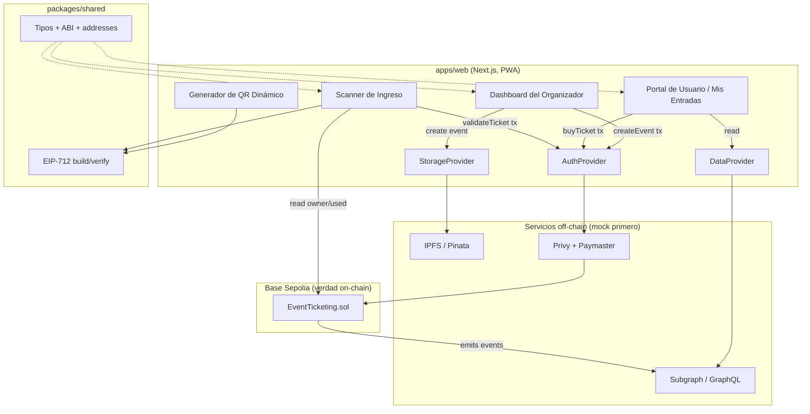

# 02 — Arquitectura

## On-chain vs off-chain: el modelo mental

La idea más importante de este sistema es la división entre lo que vive **on-chain**
(en el smart contract, permanente y sin necesidad de confianza) y lo que vive **off-chain** (la app,
el subgraph, IPFS — rápidos y baratos, pero no autoritativos).

- **On-chain (la fuente de verdad):** quién posee cuál entrada, si una entrada está usada, los
  topes de precio y el dinero. Si dos fuentes discrepan, gana el contrato.
- **Off-chain (por velocidad y UX):** el sitio web, la generación del QR, los datos indexados que
  lee la UI, y las imágenes. Nada de esto puede _mentir_ sobre la propiedad, porque la verdad siempre
  es verificable contra la cadena.

Una regla útil: **las escrituras van a la cadena, las lecturas vienen del subgraph.** Cuando compras o
validas una entrada, envías una transacción al contrato. Cuando la UI lista eventos o tus
entradas, consulta al subgraph (que replica el estado de la cadena) para que sea instantáneo.

## Diagrama de componentes



## La vida de una entrada (recorrido de punta a punta)

Sigue una entrada desde su creación hasta el ingreso. Este es el flujo al que sirve toda la base de código.

1. **El organizador crea un evento.** En el dashboard del organizador, completa un formulario y adjunta
   una imagen. La imagen + metadata van a IPFS (vía `StorageProvider`), luego la app envía
   transacciones `createEvent` y `addTier` al contrato (vía `AuthProvider`, sin gas).
2. **El contrato emite eventos.** `EventCreated` y `TierAdded` quedan registrados on-chain. El
   subgraph está escuchando y registra el nuevo evento para que la UI pueda mostrarlo.
3. **Un fan compra una entrada.** En la página del evento hace clic en comprar. La app llama a `buyTicket`. El
   contrato cobra el pago (ETH o USDC), acuña una unidad ERC-1155 y asigna el siguiente
   **serial** para ese tier, registrando al fan como su dueño. Emite `TicketPurchased`.
4. **El fan abre "Mis Entradas".** La app consulta al subgraph por las entradas del fan.
   Para la entrada elegida construye un QR: un payload `(eventId, tier, serial, owner, timestamp,
nonce)` que la wallet del fan **firma** vía EIP-712 — off-chain, sin gas. El QR se refresca
   cada ~30–60 s con un nuevo timestamp, así que una captura de pantalla expira.
5. **En el ingreso, el personal escanea el QR.** La app del scanner:
   - verifica la firma localmente (¿recupera al dueño declarado?),
   - revisa la vigencia (¿está el timestamp dentro de la ventana permitida?),
   - lee la cadena para confirmar que ese dueño todavía tiene ese serial y no está usado aún,
   - luego llama a `validateTicket`, que marca el serial como usado y emite `TicketValidated`.
     Un segundo escaneo de la misma entrada (o de una capturada) ahora falla — ya está usada o
     expiró.
6. **Reventa (opcional).** Si el fan quiere vender, no puede simplemente transferir el token — el
   contrato bloquea las transferencias directas. Debe usar `resellTicket`, que rechaza cualquier precio
   por sobre el `maxResalePrice` del tier, mueve el serial al comprador y dirige el pago.

## Por qué importan las abstracciones de proveedor

De otra forma, tres servicios externos requerirían cuentas y claves de API antes de poder construir
cualquier cosa. En su lugar, cada uno se oculta detrás de una interfaz:

| Interfaz          | Responsabilidad                             | Mock (ahora)         | Real (después)     |
| ----------------- | ------------------------------------------- | -------------------- | ------------------ |
| `AuthProvider`    | login, obtener address, firmar, enviar tx patrocinada | cuenta de dev local  | Privy + paymaster  |
| `StorageProvider` | subir imagen + metadata                     | en memoria / data URL | Pinata (IPFS)      |
| `DataProvider`    | listar eventos, mis entradas, analíticas    | fixtures             | subgraph (GraphQL) |

La app depende solo de la interfaz. Una única factory lee una variable de entorno
(`NEXT_PUBLIC_AUTH_PROVIDER=mock|privy`, etc.) y devuelve la implementación activa. Salir a
producción es un cambio de configuración, no una reescritura. Por eso podemos construir y probar todo el
camino feliz antes de registrarnos en un solo servicio de terceros.

## Cómo se relacionan los paquetes del monorepo

```
apps/web ──depende de──► packages/shared ──generado desde──► packages/contracts
   │                                                              ▲
   └── lee vía DataProvider ──► packages/subgraph ──indexa──────┘
```

- `contracts` es la verdad on-chain; su ABI y sus addresses se exportan a `shared`.
- `shared` contiene tipos + el ABI + los helpers EIP-712, para que `web` y el scanner firmen y
  verifiquen de la _misma manera_.
- `subgraph` indexa los eventos del contrato; `web` los lee a través de `DataProvider`.

Siguiente: **[03-monorepo.md](./03-monorepo.md)** para ver el bootstrap concreto sobre el que estás parado.
